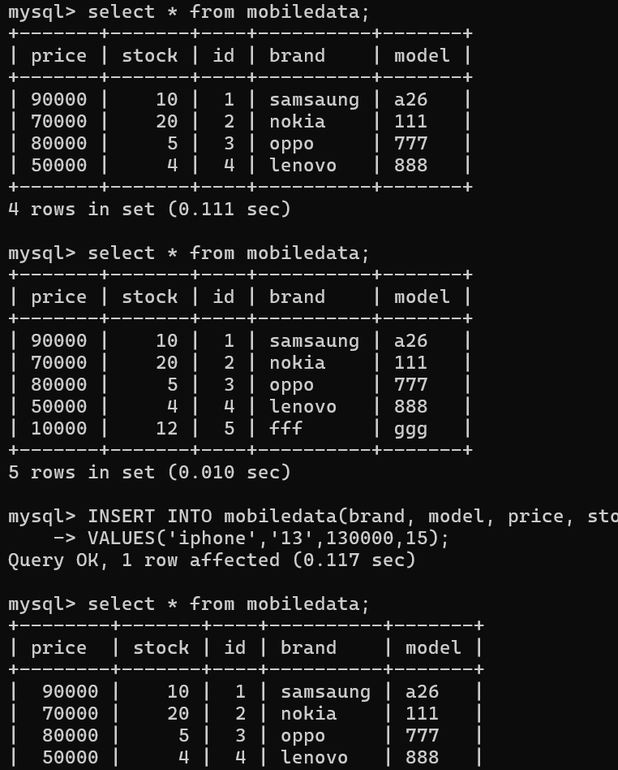
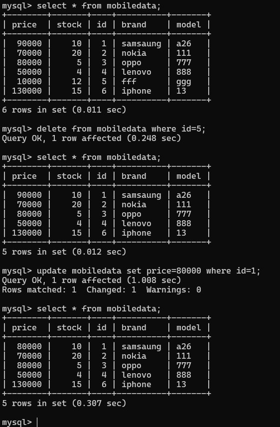
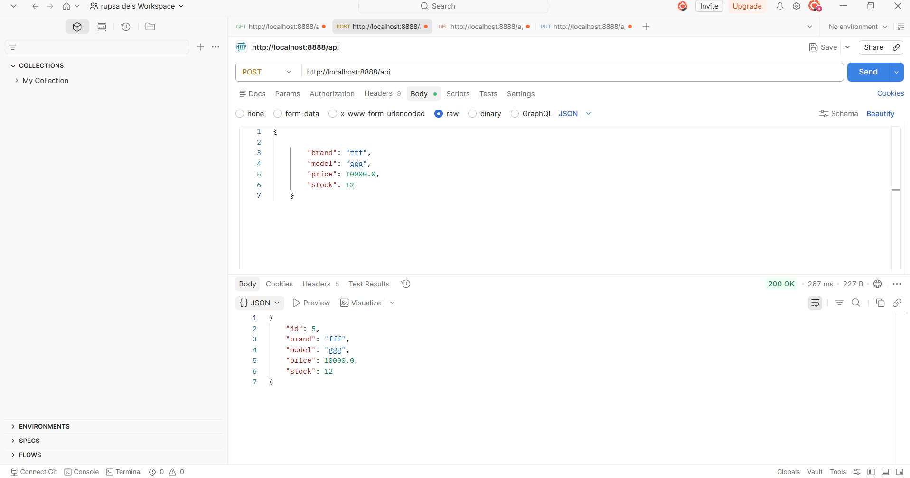
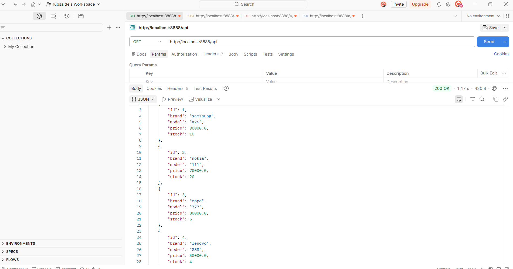
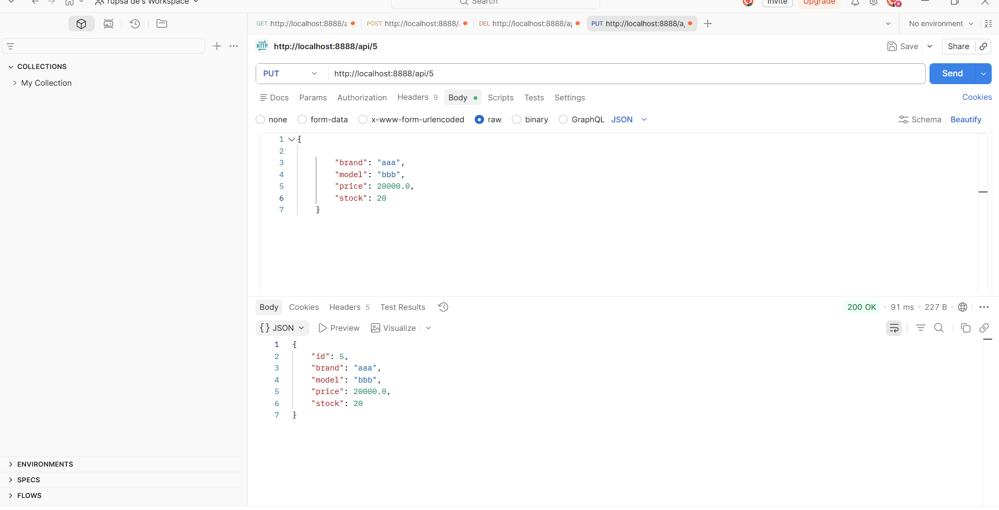
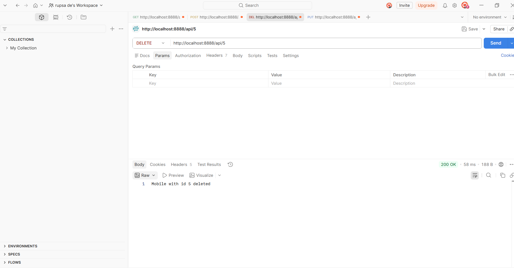
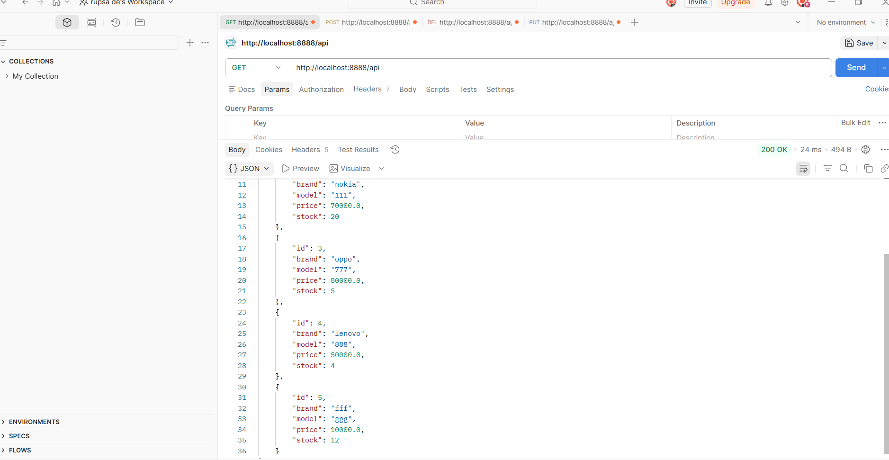
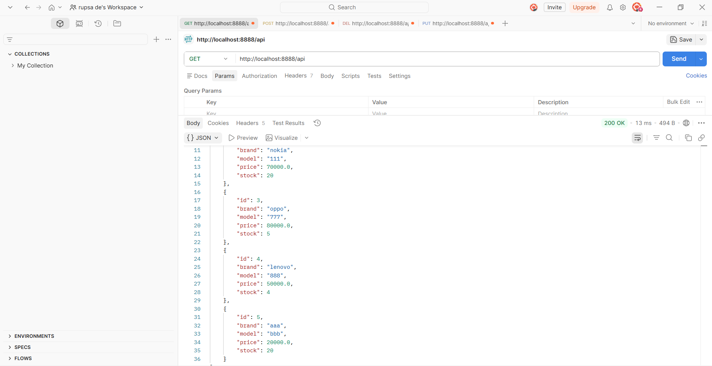
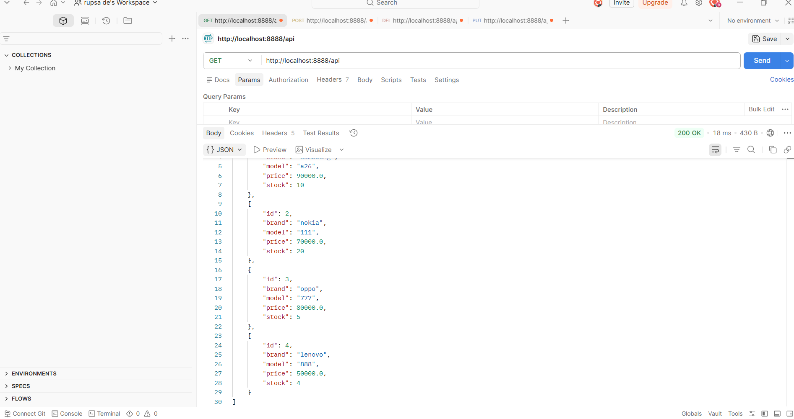

# 📱 Mobile Management System

### Spring Boot + JPA REST API for Managing Mobile Phone Inventory

A backend application demonstrating a **layered Spring Boot architecture** (Controller → Service → Repository → Entity) using **Spring Boot**, **Spring Data JPA**, **Hibernate**, and **MySQL** to manage a catalog of mobile phones.

[](https://img.shields.io/badge/Java-25-orange) [](https://img.shields.io/badge/Spring_Boot-4.0.6-brightgreen) [](https://img.shields.io/badge/Database-MySQL-blue) [](https://img.shields.io/badge/Build-Maven-yellow) [](https://img.shields.io/badge/Status-Completed-brightgreen)

---

# 📌 Project Overview

This project demonstrates how to build a CRUD REST API in Spring Boot backed by MySQL, using JPA/Hibernate for persistence.

The application manages:

- 📱 **Mobile** — brand, model, price, and stock

The project focuses on layered architecture, DTO-based validation, entity–DTO conversion, repository pattern, and centralized exception handling.

---

# 🏗️ System Architecture

```
Client
   |
   |  HTTP Request
   ▼
MobileController
   |
   ▼
MobileService (interface)
   |
   ▼
MobileServiceImpl  ──uses──▶  Converter (Entity ⇄ DTO)
   |
   ▼
MobileRepository (JpaRepository)
   |
   ▼
MySQL Database (mobiledata table)
```

### ✨ Entity–DTO Conversion

Instead of a mapping library, conversion is handled explicitly via a `Converter` utility class:

```java
public static MobileDto entityToDto(Mobile mobile) { ... }
public static Mobile dtoToEntity(MobileDto mobileDto) { ... }
```

This keeps the `Mobile` entity decoupled from what's exposed over the API.

---

# 🚀 Features

✅ Add a New Mobile

✅ Retrieve All Mobiles

✅ Retrieve a Single Mobile by ID

✅ Update an Existing Mobile

✅ Delete a Mobile by ID

✅ Request Validation (`@NotBlank`, `@Min`)

✅ Custom Exception Handling for Missing Records

✅ Auto-Seeded Sample Data on Startup

✅ JPA Repository Operations

✅ Hibernate ORM Integration

✅ RESTful API Architecture

✅ Lombok Integration

---

# 🛠️ Tech Stack

| Technology         | Purpose                        |
| ------------------- | -------------------------------- |
| Java 25              | Core Programming Language        |
| Spring Boot 4.0.6    | Backend Framework                |
| Spring Data JPA      | Database Operations              |
| Hibernate            | ORM Framework                    |
| MySQL                | Data Storage                     |
| Lombok                | Boilerplate Reduction            |
| Maven                 | Dependency Management            |

---

# 📂 Project Structure

```
src/main/java/com/example
│
├── controller
│   └── MobileController.java
│
├── entity
│   └── Mobile.java
│
├── dto
│   └── MobileDto.java
│
├── repository
│   └── MobileRepository.java
│
├── service
│   ├── MobileService.java
│   └── impl
│      └── MobileServiceImpl.java
│
├── config
│   ├── Converter.java
│   └── DataLoader.java
│
├── exception
│   └── MobileNotFoundException.java
│
└── MobileManagementApplication.java
```

```
src/main/resources
│
├── application.properties
├── static
└── templates
```

---

# 🗄️ Database Design

## Mobile Table (`mobiledata`)

| Column | Type    | Notes                     |
| ------ | ------- | -------------------------- |
| id     | Long    | Auto-generated primary key |
| brand  | String  | Required                   |
| model  | String  | Required                   |
| price  | Double  | Must be ≥ 100               |
| stock  | Integer | Must be ≥ 10                |

### 🖥️ MySQL Table in Action

Inserting a new record directly via SQL and confirming it through `SELECT`:



Deleting and updating a record via SQL:



---

## 🚀 API Endpoints

### 📱 Mobile Management APIs

| Method | Endpoint     | Description               |
| ------ | ------------ | -------------------------- |
| POST   | `/api`       | Add a new mobile           |
| GET    | `/api`       | Get all mobiles            |
| GET    | `/api/{id}`  | Get a mobile by ID         |
| PUT    | `/api/{id}`  | Update an existing mobile  |
| DELETE | `/api/{id}`  | Delete a mobile by ID      |

---

### 📌 Sample Requests

#### Add a Mobile

```
POST /api
Content-Type: application/json
```

```json
{
  "brand": "fff",
  "model": "ggg",
  "price": 10000.0,
  "stock": 12
}
```



#### Get All Mobiles

```
GET /api
```



#### Get Mobile By ID

```
GET /api/5
```

#### Update a Mobile

```
PUT /api/5
Content-Type: application/json
```

```json
{
  "brand": "aaa",
  "model": "bbb",
  "price": 20000.0,
  "stock": 20
}
```



#### Delete a Mobile

```
DELETE /api/5
```



---

### ✅ Response Example

```json
{
  "id": 1,
  "brand": "Samsung",
  "model": "Galaxy A26",
  "price": 90000.0,
  "stock": 10
}
```

---

# ⚙️ Installation & Setup

## Clone Repository

```
git clone https://github.com/Rupsa667/mobile-management-system-using-mysql.git
```

---

## Open Project

```
cd mobile-management-system-using-mysql
```

---

## Configure Database

Update:

```
src/main/resources/application.properties
```

```properties
spring.datasource.url=jdbc:mysql://localhost:3306/mobile_db
spring.datasource.username=your_username
spring.datasource.password=your_password

spring.jpa.hibernate.ddl-auto=update
spring.jpa.show-sql=true
```

> On startup, `DataLoader` automatically seeds the database with 4 sample mobiles (Samsung, Nokia, Oppo, Lenovo) via `CommandLineRunner`.

---

## Run Application

Using Maven:

```
mvn spring-boot:run
```

or

```
./mvnw spring-boot:run
```

The API will be available at `http://localhost:8080/api`.

---

# 📸 API Testing Walkthrough (Postman)

A full CRUD cycle tested against the running application:

**1. GET all mobiles (initial seeded data)**


**2. POST a new mobile**


**3. GET all mobiles (after add)**


**4. PUT update the new mobile**


**5. GET all mobiles (after update)**


**6. DELETE the mobile**


**7. GET all mobiles (after delete)**


---

# 📖 JPA Concepts Demonstrated

### Entity Mapping

```
@Entity
@Table(name = "mobiledata")
@Id
@GeneratedValue(strategy = GenerationType.IDENTITY)
```

### DTO Pattern with Validation

```
public record MobileDto(
    Long id,
    @NotBlank String brand,
    @NotBlank String model,
    @Min(100) Double price,
    @Min(10) Integer stock
)
```

### Hibernate ORM

- Entity Mapping
- Persistence Context
- Automatic Table Creation
- Repository Pattern

These concepts follow standard JPA/Hibernate approaches for a layered Spring Boot REST API.

---

# 🎯 Learning Outcomes

By studying this project you will understand:

- Spring Boot Project Structure
- Spring Data JPA
- Hibernate ORM
- DTO ↔ Entity Conversion
- Bean Validation (Jakarta Validation)
- REST API Development
- Repository Pattern
- Dependency Injection
- Startup Data Seeding with `CommandLineRunner`

---

# 👩‍💻 Author

### Rupsa

---

### ⭐ If you found this project helpful, consider starring the repository!
